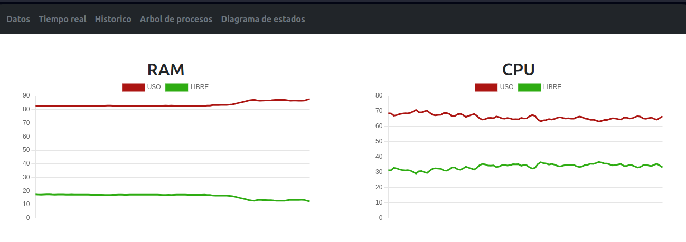
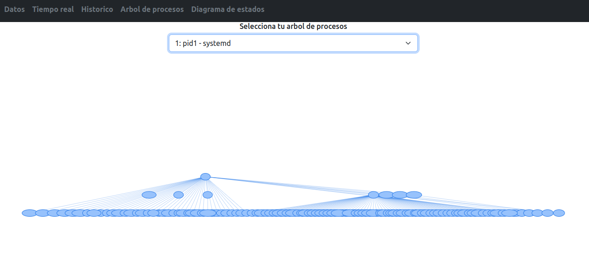
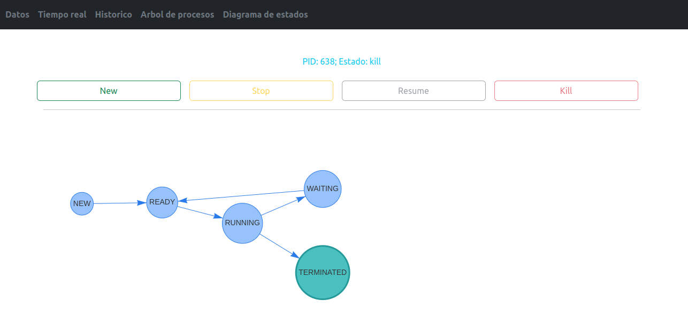

# MANUAL PROYECTO1

## MODULOS
Los modulos utilizan las apis del Kernel de linux para obtener información del sistema, estos fueron realizados en C

* CPU : cpu_so1_1s2024
    * Utilizando para obtener el porcentaje de utilización del CPU y los procesos existentes
* RAM : ram_so1_1s2024
    * Utilizando para obtener el porcentaje de utilización de la memoria princial

Los modulos son insertados en la carpeta proc y puedes ser leidos como 

```c
    cat  /proc/ram_so1_1s2024
    cat  /proc/cpu_so1_1s2024
```

## BACKEND
API server creado con el lenguaje Go que estará escuchando en el puerto 2024, tienen las siguientes funciones y endpoints

* Funciones
    * Consultar la información de los modulos RAM y CPU
    * Almacenar los datos en una base de datos mysql
    * Administrar los estados de los procesos
* Endpoints
    * /api/ram : devuelve los porcentajes de utilización de la memoria principal
    * /api/ram-records: Devuelve los registros de la utilización de la memoria ram a lo largo del tiempo
    * /api/cpu: Devuelve los porcentajes de utilización del CPU
    * /api/cpu-records: Devuelve los registros de la utilización del CPU
    * /api/cpu-processes: Obtiene los procesos que se estan ejecutando en elsistema
    * /api/process-current: Recupera el historial del ultimo proceso manipulado por los siguientes endpoints
    * /api/process-start: Crea un nuevo proceso
    * /api/process-stop?pid=$1: Detiene el proceso recibido
    * /api/process-resume?pid=$1: Reanuda el proceso recibido
    * /api/process-kill?pid=$1: Finaliza el proceso recibido 
    
    <br>

La api utiliza las siguientes variables de entorno
* DB_USER=root
* DB_PASSWORD=1234
* DB_HOST=localhost
* DB_PORT=3306
* DB_NAME=so1proyecto1
* PORT_HOST=2024

## FRONTEND
El frontend es una aplicación creada con react + vite. <br>

Para los archivos estáticos se utilizó un volumen llamado react_static_files

Sus modulos se despliegan a través de un navbar en la parte superior


### Tiempo real
Muestra los porcentajes de utilización de la memoria RAM y el CPU


### Historico
Registra un historico del porcentaje de utilización de la memoria RAM y el CPU a lo largo del tiempo


### Arbol de procesos
Aquí se puede visualizar en forma de arbol los procesos con sus respectivos hijos


### Diagrama de estados
En este apartado se puede simular como se crea, detiene, reanuda y termina un proceso



### NgInx
Se utilizo un nginx para desplegarlo con los sigientes proxys_pase para la comunicación con el backend

## BASE DE DATOS
Se utilizó una base de datos mysql creando un esquema con el nombre so1proyecto1. Se utilizó el usuario root y la contraseña descrita adelante en el apartado del archivo de docker compose


Para mantener los datos persistentes se utilizó un volumen llamado base_mysql

## NGINX
Para la comunicación del frontend y backend se utilizo proxy_pass para manejar los endpoints

```c
location /api/ram {
    proxy_pass http://backend:2024/api/ram;
    proxy_set_header Host $host;
    proxy_set_header X-Real-IP $remote_addr;
    proxy_set_header X-Forwarded-For $proxy_add_x_forwarded_for;
    proxy_set_header X-Forwarded-Proto $scheme;
}
```

```c
fetch("/api/ram")
    .then(response => response.json())
    .then(data => {})
```

Para los archivos estáticos se utilizó un volumen llamado react_static_files

## DOCKER COMPOSE

Se utilizaron 4 servicios y dos volumenes, las imagenes se subieron a [docker hub](https://hub.docker.com/u/jlixdocker) después de compilar las imagenes por lo que las lineas build se pueden omitir.

Para el backend se utilizó otros dos volumenes para la comunicación con los modulos que se encuentran en la carpeta /proc

```c
version: '3'
services:
  base:
    image: "mysql"
    container_name: 'MYSQL_Base'
    restart: always
    environment:
      MYSQL_ROOT_PASSWORD: dark
    volumes:
      - base_mysql:/var/lib/mysql      
    ports:
      - "3306:3306"
  backend:
    image: "so1proyecto1backgo"
    container_name: 'Backend_Go'
    restart: always
    build: ./back
    environment:
      DB_USER: root
      DB_PASSWORD: dark
      DB_HOST: MYSQL_Base
      DB_PORT: 3306
      DB_NAME: so1proyecto1
      PORT_HOST: 2024
    ports:
      - "2024:2024"
    volumes:
    - type: bind
      source: /proc
      target: /proc
  web:
    image: "so1proyecto1frontreact"
    container_name: 'FrontReact'
    restart: always
    build: ./front
    volumes:
      - react_static_files:/usr/src/proyecto1/react/dist
  nginx:
    image: nginx:alpine
    ports:
      - "80:80"
    volumes:
      - ./nginx.conf:/etc/nginx/conf.d/default.conf
      - react_static_files:/etc/nginx/html
    depends_on:
      - backend
volumes:
  base_mysql:
  react_static_files: {}
```