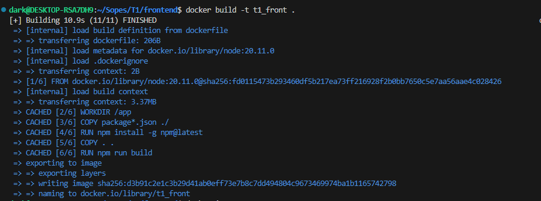
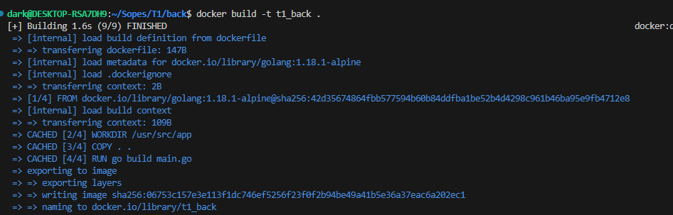

# Tarea 1  - 201504115

#### Video
https://drive.google.com/file/d/1toxDSfL_8bRBOrPGrFzNEkotah9T1VHM/view?usp=sharing

## Imagen y contenedor para FRONT

## Imagen y contenedor para BACK

## Creando contenedor y ejecuntadose el front

## Docker Ps Ejecutandose back y front

## Datos obtenidos
